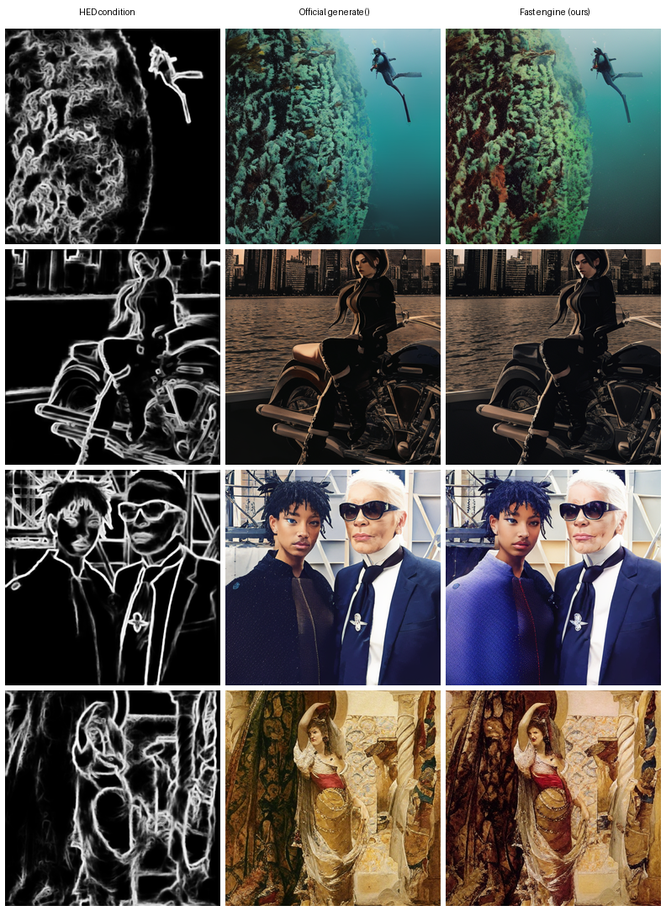

# ControlAR Fast Inference Engine

A drop-in fast sampling engine for ControlAR, built on `torch.compile` with
CUDA graph capture (gpt-fast style static KV cache). It is **numerically
equivalent** to the official `generate()` implementation while being an order
of magnitude faster.

## Performance

Measured on RTX 3090, GPT-XL, 1024 tokens/image, hed.safetensors, bf16:

| Metric | Official | Fast Engine | Speedup |
| :----- | :------: | :---------: | :-----: |
| Single-image latency (n=1) | 64.8 s (15.8 tok/s) | **5.7 s** (179.5 tok/s) | **11.4×** |
| Batch throughput (n=8) | 147.9 tok/s | **976.9 tok/s** | **6.6×** |
| Batch throughput (n=32) | 147.9 tok/s | **1297.4 tok/s** | **8.8×** |

Accuracy (MultiGen-20M val, 5000 images, cfg=4, top-k=2000):

| Metric | Paper | Fast Engine |
| :----- | :---: | :---------: |
| SSIM | 85.63 | **85.50** |
| FID | 10.53 | **9.51** |

Teacher-forced fp32 logit comparison against the official eager
implementation shows identical distributions (max log-prob difference 0.0000,
identical top-5 tokens), i.e. CUDA graph replay does not change the sampling
mathematics.

## Visual comparison

Paired samples from the MultiGen-20M validation split — same HED condition
and same prompt, official `generate()` vs. the fast engine:

<div align="center">

</div>

Analysis:

- **Structure and layout are preserved identically**: both samplers follow the
  HED condition equally well (poses, object placement, background geometry
  match the edge map in the same way).
- **Colors and textures differ slightly between the two columns.** This is
  expected: sampling is stochastic (`multinomial` over identical logits), so
  two runs draw different samples from the *same* distribution — the same
  variation you would get by running the official sampler twice with
  different seeds. Equivalence is therefore verified at the distribution
  level, not pixel level: fp32 teacher-forced Δlogp = 0.0000, and on the full
  5000-image validation protocol the fast engine matches the paper within
  noise (SSIM 85.50 vs. 85.63, FID 9.51 vs. 10.53).
- **No visual artifacts are introduced** by CUDA graph replay or kernel
  autotuning — no drift, no edge misalignment, no color shift beyond ordinary
  sampling variance.

## How it works

The official implementation spends most of its per-step time on Python
scheduling and kernel-launch overhead rather than GPU compute. The engine
therefore restructures sampling for whole-graph replay:

1. **torch.compile (`mode="reduce-overhead"`, `fullgraph=True`)**: Inductor
   fusion plus CUDA graph capture of the prefill/decode forward, turning each
   decode step into a single graph replay.
2. **End-to-end decode step**: the full decode step (forward + CFG merge +
   top-k + multinomial sampling) is captured in one CUDA graph.
3. **max-autotune**: GEMM kernel autotuning for the bandwidth-bound decode
   regime.
4. **CUDA-graph safety fixes** in `generate_fast`: the `condition_token`
   produced by prefill is cloned out of the graph memory pool, and each
   sampled token is cloned out of the pool before the next replay.

Sampling logic (CFG merge, top-k/temperature/multinomial) is line-by-line
identical to the official implementation, and the static KV cache reuses the
official `setup_caches`.

## Usage

Single image (first run includes ~2-3 min of compilation):

```bash
PYTHONPATH=$PWD python fast_inference/fast_engine.py \
    --gpt-ckpt checkpoints/t2i/hed.safetensors \
    --condition-path condition/example/t2i/multigen/eye.png \
    --prompt "a beautiful blue eye, ultra detailed" \
    --compile-mode reduce-overhead --e2e --num-images 1 --warmup 1 \
    --out /tmp/fast.png
```

Batch generation of the MultiGen-20M validation split (shard across GPUs with
`--start/--end`):

```bash
PYTHONPATH=$PWD CUDA_VISIBLE_DEVICES=0 python fast_inference/fast_eval.py \
    --start 0 --end 1250 --batch 16 --out sample/multigen/hed_fast
```

Notes:

- A new batch size triggers a one-time graph capture; keep the batch size
  fixed for batch jobs.
- Memory footprint is ~4 GB (bf16 model + KV cache + graph pool).
- `--cfg-interval N` optionally drops the unconditional branch after N decode
  steps (2× fewer sequences afterwards) at a small quality cost; it is off by
  default.

## Running on other GPUs

The engine contains no GPU-specific code — `torch.compile` adapts kernels and
graph capture to your device automatically on the first run (one-time cost of
~2–3 min per batch size). To move beyond the reference RTX 3090 setup:

- **Requirements**: Linux, PyTorch ≥ 2.1 with CUDA, and an NVIDIA GPU with
  compute capability ≥ 8.0 (Ampere/Ada/Hopper) for bf16 + CUDA graphs +
  Triton. CPU, macOS and ROCm are not supported by this path.
- **Memory sizing**: total VRAM ≈ 1.6 GB (bf16 weights) + ~0.4 GB KV cache
  per sequence (including the CFG branch) + a small graph pool. Rule of thumb
  for `--batch`: 24 GB → 16–32, 48 GB (A6000/A40) → 64, 80 GB (A100/H100) →
  128+. Keep the batch size fixed within a job — every new batch size triggers
  a fresh graph capture.
- **Faster GPUs**: decode is weight-bandwidth-bound, so throughput scales
  roughly with memory bandwidth — expect substantially higher tok/s on
  A100/H100 with no code changes; just raise `--batch`.
- **Multi-GPU**: no model parallelism needed; shard the workload data-parallel
  style, e.g. for 4 GPUs run four processes with
  `CUDA_VISIBLE_DEVICES=k ... --start <1250*k> --end <1250*(k+1)>`.
- **Older GPUs (V100, sm_70)**: bf16 is unsupported — switch
  `precision = torch.bfloat16` to `torch.float16` in `fast_engine.py` and
  `fast_eval.py`, and expect a smaller speedup than reported here.
